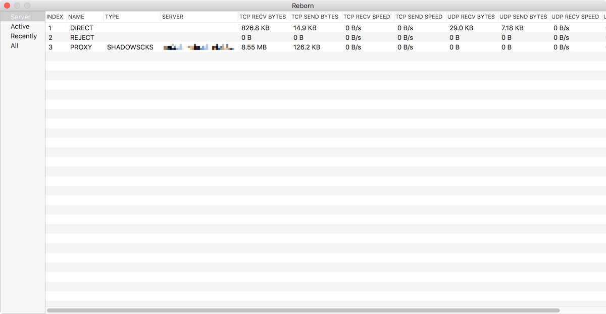
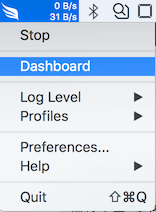
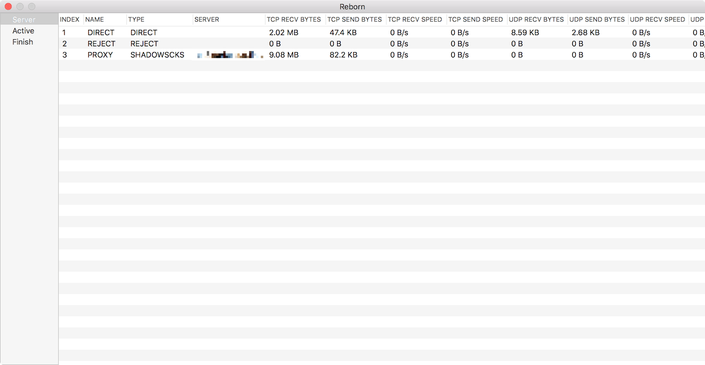

# Reborn

**如果使用的是 0.5.0 之前版本的，请参考[旧版使用说明](./discarded/v1/README.md)**

## 功能介绍

Reborn 是一款 macOS 上的透明代理

* 对用户无感知，无需配置系统代理，自动接管所有应用程序（如浏览器和终端工具）流量
* 支持根据 IP、域名、GEOIP 规则进行分流，屏蔽特定网站
* DNS 解析对 CDN 友好
* 可以查看所有经过 Reborn 转发的连接


## 流量监控功能

状态栏显示实时网速




打开 Dashboard 查看统计信息



流量统计




当前活跃连接


## 注意事项

配置规则仓库下有个[模版文件](./v2/template.conf)，大概看看就能看懂了，配置文件放到 Profiles 目录下就好了。

如果将`reborn`作为前端配合其他工具使用，则需要对其他工具配置进程规则。

由于是通过虚拟网卡实现的，所有如果要用 ping, traceroute 等功能，加 -S/-s 指定具体网卡吧。

最后说明一下，内置了 crash 上报会上传到 hockeyapp 和版本升级检测的，没有其他额外的网络功能了。


**希望碰到图标自动变灰（服务挂了）的情况能够反馈下如何出现的，比如访问某个网站，使用了某个工具，日志文件在 `~/Library/Application Support/Reborn/XLogs` 目录下**

## 导航

**配置详解**

https://github.com/langyanduan/Reborn/blob/master/v2/DETAIL.md


**基础配置模版**

https://github.com/langyanduan/Reborn/blob/master/v2/template.conf


**下载地址**

https://github.com/langyanduan/Reborn/releases


## QA

### 1. 如何判断 `Reborn` 已启用，并接管了流量

查看网卡信息，输入命令 `ifconfig`，可以看到 `utun6` 为 `Reborn` 创建的虚拟网卡

```  
utun6: flags=8051<UP,POINTOPOINT,RUNNING,MULTICAST> mtu 1500
    inet 240.0.200.2 --> 240.0.200.255 netmask 0xffffff00
    inet6 fe80::147e:ad68:d777:e455%utun6 prefixlen 64 secured scopeid 0xf
    nd6 options=201<PERFORMNUD,DAD>
```


查看路由表，输入 `netstat -nr`，可以看到 `utun6` 作为默认下一跳地址排在第一位

```
Routing tables

Internet:
Destination        Gateway            Flags        Refs      Use   Netif Expire
default            240.0.200.1        UGSc           71       21   utun6
default            192.168.1.1        UGScI          11        0     en0
```

使用 `ping` 任意地址，响应时间都是小数毫秒级别，说明 icmp 协议均被本地接管

```
➜  reborn git:(master) ping 8.8.8.8
PING 8.8.8.8 (8.8.8.8): 56 data bytes
64 bytes from 8.8.8.8: icmp_seq=0 ttl=255 time=0.169 ms
64 bytes from 8.8.8.8: icmp_seq=1 ttl=255 time=0.201 ms
64 bytes from 8.8.8.8: icmp_seq=2 ttl=255 time=0.312 ms
64 bytes from 8.8.8.8: icmp_seq=3 ttl=255 time=0.174 ms
64 bytes from 8.8.8.8: icmp_seq=4 ttl=255 time=0.193 ms
^C
--- 8.8.8.8 ping statistics ---
5 packets transmitted, 5 packets received, 0.0% packet loss
round-trip min/avg/max/stddev = 0.169/0.210/0.312/0.052 ms
```

### 2. 如何作为前端使用

需要配置进程规则，如使用 `ss-local` 作为后端

```
[RULES]
...
PROCESS, ss-local, DIRECT
...
```

### 3. 如何查看日志

日志在路径 `~/Library/Application Support/Reborn/XLogs` 下。  
可以使用脚本查看具体内容，脚本在路径 `/Applications/Reborn.app/Contents/MacOS/decode_mars_nocrypt_log_file.py`

### 4. 使用 iPhone 的个人热点并以 USB 方式连接电脑, 会造成个人热点以规律的方式连接断开

把 *系统偏好设置-网络-iPhone USB* 中的 *除非需要，否则请停用* 勾去掉

## 更新记录
* 0.5.31  
状态栏显示实时网速，Dashboard 支持流量统计、连接记录等功能

## 后续计划

* simple-obfs  
* v2ray 等协议支持
...
